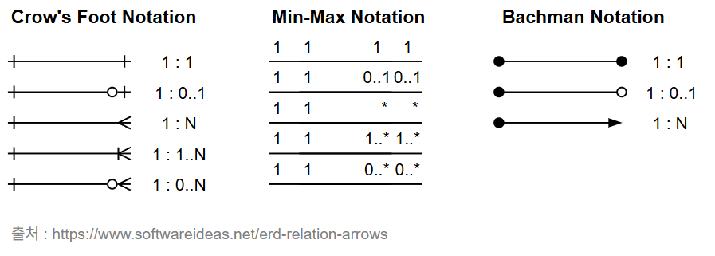

# 데이터 모델링의 정의
: 특정 정보 시스템에 대한 데이터 구조를 설계하는 과정,
데이터의 관계, 접근, 그리고 데이터 흐름에 필요한 처리 과정에 대한 추상화된 모형

## 데이터 모델링 특징
- 추상화 : 현실 세계를 추상화하여 표현
- 단순화 : 약속된 규약에 의한 표기법 사용
- 명확화 : 명확하게 하나의 의미로 해석되어야 함

## 데이터 모델링 단계
1. 개념적 모델링
    * 서비스 전체에 대한 추상화
    * 핵심 엔터티 도출

2. 논리적 모델링
    * **특정 데이터베이스 모델**의 식별자 정의 및 관계, 속성 표현
    * 정규화를 통한 데이터 재사용성 향상

3. 물리적 모델링
    * 성능, 보안, 가용성 등을 고려하여 DB 구축

## 데이터 모델링 관계
* 데이터 관점
    - 입력값/출력값을 명확히 파악하기 위해, **시스템 안에 어떤 데이터가 있고 어떤 구조로 어떻게 연결되어있는지 구조를 분석**하는 관점
    - ERD를 보고 릴레이션 간 제약 조건(예: 외래키, NOT NULL 등)을 점검
    - 구조 분석, 정적 분석

    ```
    <데이터 관점 테스트 예시>
    
    * 특징 : 구조를 기준으로 테스트
    * 테스트 목적 : 회원 테이블(user)의 제약 조건이 올바르게 작동하는지 확인
    * 테스트 항목 : 필수 컬럼 입력 여부, 유니크 키 제약 등

    * 테스트 케이스 예시
        이름 없이 가입 시도 → 실패해야 함 (NOT NULL)
        동일한 이메일로 중복 가입 시도 → 실패해야 함 (UNIQUE 제약)
        생년월일 형식을 yyyy-mm-dd가 아닌 경우 → 실패해야 함 (형식 제약)
    ```

* 프로세스 관점
    - 사용자가 어떤 행동을 했을 때, 시스템이 어떤 과정을 통해 처리하는지를 보는 관점
    - 시나리오 분석, 도메인(핵심 기능) 분석, 동적 분석을 할 수 있음
    ```
    <프로세스 관점 테스트 예시>
    
    * 특징 : 사용자 시나리오를 기준으로 테스트
    * 테스트 목적 : 전체 회원가입 흐름이 예상대로 작동하는지 확인
    * 테스트 항목 : 화면 전환, 인증 절차, 버튼 동작 등
    
    * 테스트 케이스 예시
        이메일 입력 후 인증 요청 → 인증 이메일 전송 확인
        인증 코드 입력 후 '가입 완료' 버튼 클릭 → 회원가입 성공 메시지 노출
        비밀번호 2칸이 불일치할 경우 → 경고 메시지 노출
    ```

* 데이터와 프로세스 관점
    - 프로세스별 사용하는 데이터를 분석하는 관점
    각 기능이 CRUD 동작을 하는지 분석할 수 있음
    ```
    <데이터+프로세스 관점 테스트 예시>
    
    * 특징 : 프로세스가 데이터에 어떤 영향을 주는지 확인
    * 테스트 목적 : 기능 수행 후 DB에 어떤 변화가 생기는지 확인
    * 테스트 항목 : C, R, U, D 동작
    
    * 테스트 케이스 예시
        회원가입 후 user 테이블에 INSERT 되었는지 확인 (C)
        가입한 이메일로 로그인 시도 → 조회 성공 여부 확인 (R)
        사용자 이름 변경 기능 테스트 → UPDATE 반영 여부 확인 (U)
        탈퇴 기능 실행 → 실제로 DB에서 삭제됐는지 or soft delete 됐는지 확인 (D)
    ```
  
## 데이터 모델링 고려사항
* 독립성 확보
    - 데이터 수정/확장을 고려한 독립성 확보
    - 3-Level Schema를 통해 독립성 확보 가능
    - 정규화를 통한 중복 데이터 제거

* 고객 요구사항 표현

* 데이터 품질 확보
    - 데이터 표준 정의 및 준수를 통해 데이터 품질 향상

### 3-Level Schema
: DB 동립성을 위한 3단계 구조 스키마  
각 관점에 따른 DB를 기술하고 각 계층을 뷰(View)라고 부름

* 외부 스키마
    - **사용자** 관점
    - **응용 프로그램**이 접근하는 DB
    - 여러개의 외부 스키마가 존재함
    - UI 테스트, API 테스트 수행 가능

* 개념 스키마
    - **DB 관리자(개발자)**의 관점
    - DB 전체의 **규칙과 논리 구조** 표현
    - 정적 분석, CRUD 시나리오 테스트 수행 가능

* 내부 스키마
    - **DB 시스템 설계자** 관점
    - 데이터가 DB에 물리적으로 어떻게 저장되는지, **저장 장치 관점**의 표현
    - 성능 테스트, 인덱스/대용량 처리 테스트 가능

    <span style="color:darkgray">**논리적 독립성 : 개념 스키마 변경 시, 외부 스키마가 영향을 받지 않은 것  
    물리적 독립성 : 내부 스키마 변경 시, 개념 스키마가 영향을 받지 않는 것**</span>

# 엔터티와 속성
엔터티 : 데이터베이스 내부에서 변별 가능한 객체(데이터의 집합)

## 구조에 따른 분류
* 유형 엔터티 : 변하지 않고 지속적인 엔터티
    - 사원, 제품 등

* 개념 엔터티 : 눈으로 보이지 않는 개념적 정보로 구분되는 엔터티
    - 부서, 금융상품 등

* 사건 엔터티 : 비즈니스 프로세스에 의해 발생되는 행위 엔터티
    - 구매, 판매, 대여 등

## 발생 시점에 따른 분류
* 기본 엔터티 : 독립적으로 생성 및 관리가 되는 키 엔터티
    - 고객, 부서, 제품

* 중심 엔터티 : 중간 엔터티, 기본 엔터티에서 발생하는 행위 엔터티를 생성
    - 주문, 수납, 계좌

* 행위 엔터티 : 기본 엔터티와 중심 엔터티로부터 발생하는 엔터티
    - 주문 이력, 수납 이력, 접속 이력

## 엔터티의 특징
* 업무에서 관리되는 데이터 집합
* 유일한 식별자를 가짐
* 2개 이상의 인스턴스를 가짐
* 속성
* 서로 다른 엔터티와 하나 이상의 관계를 가져야 함

## 속성
* 엔터티가 가지는 항목
* 속성은 하나의 값만 가짐
* 더이상 분리되지 않는 데이터
* 함수의 반환값이 지정되어있는것처럼, 유일한 식별자를 넣으면 반드시 나와야하는 값이 정해져있음(주식별자에 의하여 함수적으로 종속됨)

### 구성에 따른 분류
* 단일 속성 : 더이상 분할되지 않는 속성
    - ID, 성별

* 복합 속성 : 분해가 가능한 속성
    - 주소(시/구/동), 전화번호(010/나머지 번호), 주민번호(앞 6자리/뒤 7자리)

* 다중값 속성 : 여러 의미를 가질 수 있는 속성
    - 주문 목록

### 특성에 따른 분류
* 기본 속성 : 변하지 않는 속성
    - 이름, ID, 등록일시

* 설계속성 : 데이터 모델링 과정에서 발생되는 속성
    - 상품 코드, 지점코드

* 파생속성 : 다른 속성에 의해 만들어지는 속성
    - 판매가(=원가+최소이익+인건비..)

## 관계
: 엔터티간 논리적 연관성을 의미

### 분류
* 존재에 의한 관계 : 두 엔터티가 모두 존재해야 각 엔터티가 존재할 수 있음
    - 부서와 사원, 구매

* 행위에 의한 관계 : 대상과 행위의 관계
    - 고객과 주문, 사용자와 회원가입

### 식별관계와 비식별 관계
* 식별 관계 : 부모 엔터티의 기본키를 자식 엔터티가 **기본키**로도 사용하는 관계 (의존적, 강한 관계)
* 비식별관계 : 부모 엔터티의 기본키를 **일반 속성(외래키)**으로만 사용하는 관계(독립적, 약한 관계)

# ERD(Entity Relationship Diagram)
: 데이터베이스에서 사용되는 엔터티(테이블), 속성(컬럼), 관계(관계형 연결)를 시각적으로 표현한 모델링 도구

## ERD 작성 절차
1. 엔터티 도출 : 시스템에서 관리해야 할 객체(명사)를 정의
2. 엔터티 배치 : 중요 엔터티를 왼쪽 상단에 배치(읽기 흐름 고려)
3. 엔터티간 관계 설정
4. 엔터티 관계명 서술 : 관계의 의미를 현재형으로 서술
    * 관계 표기
    - 현재형으로 표기
    - 능동/수동으로 표기
    - 필수 관계, 선택 관계
    - 항상 참여하는지 선택적인지 표기

5. 관계 참여도/카디널리티 표현
    * 관계 차수
    

6. 속성 정의 : 엔터티마다 주요 속성(필드) 추가

# 식별자(key)
기본키(Primary Key) : 후보키 중 엔터티를 유일하게 식별할 수 있는 변하지 않는 키
후보키(Candidate Key) : 유일성과 최소성을 만족하는 키(기본키로 선택 가능), 슈퍼키에서 최소성을 만족하는 키

슈퍼키(Super Key) : 튜플을 유일하게 식별할 수 있는 **속성들의 집합**
유일성은 만족하지만 최소성을 만족하지 않음

대체키(Alternate Key) : 후보키 중에서 기본키를 선정하고 남은 키
외래키(Foreign Key) : 다른 테이블의 기본키를 참조하는 키, 참조 무결성 확인을 위해 사용되는 키

* 예시(중복된 주소로 회원가입 불가능하다고 가정)

|고객 테이블|Key|
|:--:|:--:|
|ID|CK, PK|
|이름||
|주소|CK, AK|
|주문 상품 번호|FK|

- 주소 + 주문 상품 번호 : SK

## 식별자의 분류
* 대표성에 따른 분류
    * 주 식별자(PK)
        - 최소성, 대표성, 유일성, 불변성
        - 다른 엔터티와 참조 관계로 연결

    * 보조 식별자(CK)
        - 유일성, 최소성 만족, 대표성 x

* 생성에 따른 분류
    * 내부 식별자 : 엔터티 내부에서 스스로 생성되는 식별자
    * 외부 식별자 : 다른 엔터티와 관계로 인해 만들어지는 식별자(FK)

* 속성 수에 따른 분류
    * 단일 식별자 : 하나의 속성으로 대표성을 만족하는 식별자(CK)
    * 복합 식별자 : 두개 이상의 속성으로 구성되어야 대표성을 만족하는 식별자(SK)

* 대체 여부에 따른 분류
    * 본질 식별자 : 비즈니스 프로세스에 의해 만들어지는 식별자
    * 인조 식별자 : 인위적으로 만들어지는 식별자

# 정규화와 반정규화
: 성능 데이터 모델링에서 정규화와 반정규화가 사용된다.

## 정규화
* 개념
    - 데이터 이상현상(Abnormality)을 줄이기 위한 설계 방법
    - 중복을 제거하고 데이터 무결성을 유지하기 위해 데이터를 분해하하는 과정
    - 데이터 일관성, 중복 최소화, 최대한의 데이터 유연성을위한 방법
    - 논리 데이터 모델링 수행 시점에서 고려해야 함

* 주의사항
    - 모든 정규화는 이전 정규화를 만족해야 함
    - 단일 테이블 조회 시, 정규화로 데이터 중복이 제거되어 조회 성능 향상 가능성 있음
    - 다중 테이블 조회 시, 정규화로 I/O 증가 및 join 연산 증가로 조회 성능 저하 가능성 있음

* 정규화 단계
    * 1NF : 속성의 원자성 확보
    
    * 2NF : 복합키인경우 부분 함수 종속성 제거

    * 3NF : 이행 함수 종속성 제거  
    → 비후보키가 결정자인 경우 허용

        <span style="color:darkgray">**이행적 종속 :  
        어떤 속성 A가 B에 종속되고,
        그 B가 다시 C에 종속될 때  
        → "A는 C에 간접적(이행적)으로 종속되었다."  
        따라서, 테이블1 : A, B / 테이블2 : B, C로 분리해야 함(3NF 규칙)**</span>

    * BCNF : 결정자 함수 종속성 제거  
    → 비후보키가 결정자인 경우 비허용

    * 4NF : 다중값 종속성(다치종속)을 제거  
    → 하나의 키가 두 개 이상의 속성에 독립적으로 종속 불가

    * 5NF : 조인 종속 제거  
    → 데이터가 분해되었을때 다시 정확히 조인할 수 있어야 함

* 이상현상(Abnormality)
    * 삽입 이상 : 행 삽입 시 지정되지 않은 속성값이 Null을 가지는 현상
    * 갱신 이상 : 데이터 갱신 시 전체가 아닌 일부분의 데이터만 갱신되는 현상(일관성 x)
    * 삭제 이상 : 행 삭제 시 원하지 않는 연쇄 삭제가 발생하는 현상

## 반정규화(역정규화)
* 개념
    - DB 성능 향상을 위해 데이터 중복을 허용하고 조인을 줄이는 방법
    - 다량의 범위/특정 범위 데이터등 **자주 사용**하는 경우 반정규화 사용
    - 클러스터링, 뷰, 인덱스, 파티셔닝 등 다른 방법으로 속도 개선이 어려울때 사용

## 반정규화 기법
* 테이블 반정규화
    * 테이블 병합 : 1:1/1:M/슈퍼-서브타입 테이블 병합
    * 테이블 분할 : 수직/수평 분할
    * 테이블 추가 : 중복/통계/이력/부분 테이블 추가

* 컬럼 반정규화
    * 중복/파생/이력테이블 컬럼 추가

* 관계 반정규화
    * 중복 관계 추가

# 데이터베이스
## 구조
* 중앙 집중형 데이터베이스 : 하나의 DB에 물리적으로 연결하여 작업 
* 분산 데이터베이스 : 하나의 DB에 네트워크로 연결하여 작업

## 분산 데이터베이스 
### 분산 데이터베이스 투명성
* 분할 투명성 (Fragmentation Transparency)  
: 하나의 논리적 관계가 여러 단편으로 분할되어있더라도 하나의 통합된 테이블처럼 사용 가능

* 위치 투명성 (Location Transparency)  
: 어느 위치에서 접근하더라도 동일한 명령으로 접근 가능

* 이름 투명성 (Naming Transparency)  
: 실제 노드나 지역 시스템의 이름을 몰라도 일관된 이름으로 데이터에 접근 가능

* 중복 투명성 (Replication Transparency)  
: 같은 데이터가 여러 위치에 복제되어 존재하더라도 사용자는 이를 단일 데이터처럼 인식하고, 시스템이 일관성을 보장해야 함

* 장애 투명성 (Failure Transparency)  
: 데이터베이스가 분산되어있는 각 지역의 시스템이나 통신망에 문제가 발생해도 데이터의 무결성 보장

* 병행 투명성 (Concurrency Transparency)  
: 분산 데이터베이스에 대한 병렬 트랜잭션이 일어나는 경우에도 결과에 이상이 없어야 함

### 분산 데이터베이스 설계 방식
* 상향식 설계 방식 : **지역 스키마** 작성 후 **전역 스키마** 작성
* 하향식 설계 방식 : **전역 스키마** 작성 후 **지역 스키마** 작성

## 분산 데이터베이스 장점
* 데이터의 신뢰성과 가용성이 높음
* 병렬처리로 인해 수행속도 빠름
* 분산 데이터베이스 추가로 시스템 용량 확장 용이

## 분산 데이터베이스 단점
* 분산구조로 인해 관리 및 통제가 어려움
* 보안, 무결성 관리가 어려움
* DB 설계의 복잡성