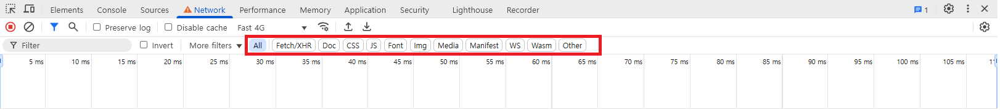
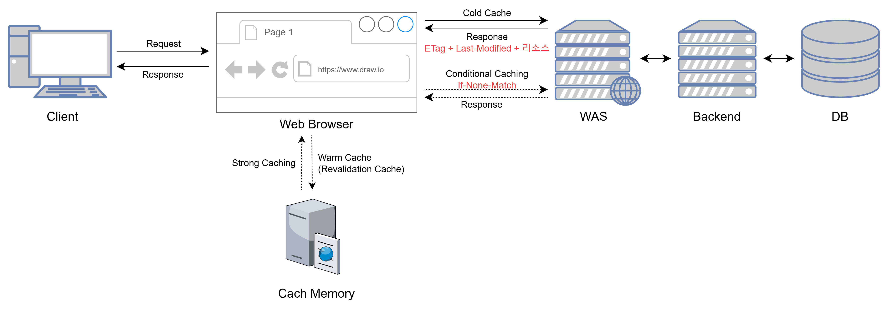
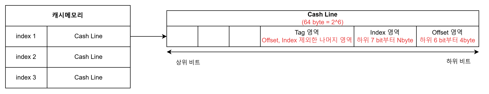
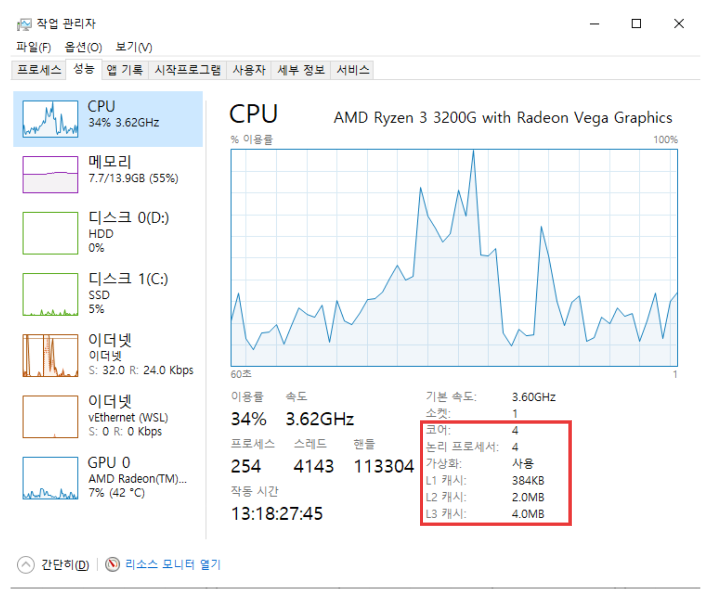
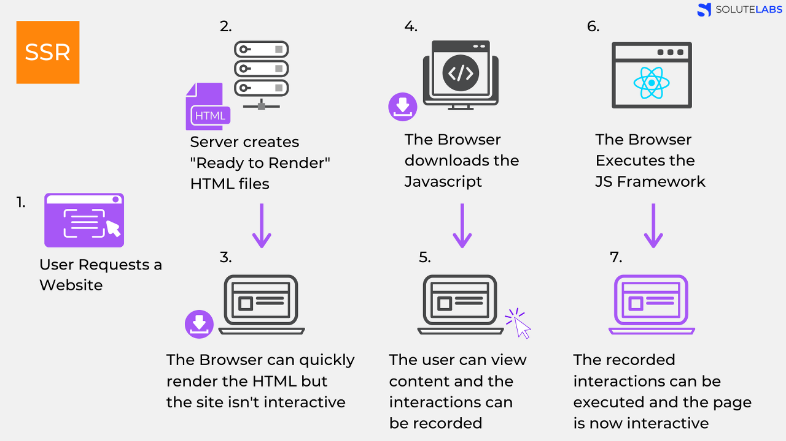

[참고 링크] https://developer.chrome.com/docs/devtools/tips?hl=ko  
[CWV] https://web.dev/articles/vitals?hl=ko  
[참고 링크] https://developer.chrome.com/docs/devtools/performance/overview?hl=ko

<!-- # Tips 1 : Record and analyze a performance trace
## Setting
크롬 성능 측정 시 시크릿 모드 실행
Performance > Environment serrings > Network 속도 'Fast 4G'로 변경

<br/> -->
## Network 탭
### Filter 버튼


* All   
: 페이지 로드 중 발생한 모든 요청(HTML, CSS, JavaScript, 이미지 등) 표시

* Fetch/XHR  
: Fetch API나 XMLHttpRequest(XHR)를 사용한 네트워크 요청 표시
동적 데이터 요청 디버깅에 유용하며, Ajax 요청 관련 데이터나 REST API 호출 확인에 사용

* Doc
: 페이지의 주요 HTML 파일이나 iframe 로드 상태를 확인 가능

* CSS 
: 페이지의 스타일 관련 네트워크 요청을 확인하거나, 스타일시트 로딩 문제를 디버깅할 때 사용

* JS  
: 스크립트 로드 상태와 관련된 문제를 확인하거나 특정 스크립트 파일의 요청 지연을 추적 가능

* Font : 웹 폰트 파일(e.g., WOFF, TTF)의 로드 상태나 성능 문제 확인

* Img
이미지 파일 요청만 표시합니다.
이미지 로딩 문제를 디버깅하거나 특정 이미지의 크기와 로드 시간을 확인할 때 유용합니다.

Media
비디오, 오디오 등 멀티미디어 파일 요청만 표시합니다.
스트리밍 관련 문제를 디버깅하거나 미디어 파일의 로드 상태를 추적할 때 사용됩니다.

Manifest
웹 애플리케이션 매니페스트 요청만 표시합니다.
PWA(Progressive Web App)와 관련된 설정 파일의 로드 상태를 확인할 수 있습니다.

WS (WebSocket)
WebSocket 연결 요청만 표시합니다.
실시간 데이터 전송과 관련된 WebSocket 통신 상태를 확인하거나 디버깅할 때 사용됩니다.

Wasm
WebAssembly 파일 요청만 표시합니다.
Wasm 모듈의 로드 상태와 성능 문제를 디버깅할 때 적합합니다.

Other
위의 카테고리에 해당하지 않는 기타 요청을 표시합니다.
주로 특정한 형식이 없는 사용자 정의 요청이나 서버 로그와 같은 비표준 데이터를 확인할 때 유용합니다.


# Web Vitals(웹 성능 지표)
* FCP, First Contentful Paint
: 페이지 로드가 시작된 시점부터 페이지 콘텐츠의 일부가 화면에 렌더링되는 시점까지의 시간

* TTI, Time To Interactive
: 사용자 인터렉션이 가능할때까지 걸리는 시간

* SI, Speed Index
: 페이지가 표시되는 속도

* TBT, Total Blocking Time
: 첫 번째 콘텐츠가 표시되고 사용자가 인터렉션이 가능해지는 시간동안 메인 스레드를 블로킹하는 작업 시간

* LCP, Largest Contentful Paint
: 가장 마지막으로 콘텐츠가 표시되는 시간(최대 콘텐츠 렌더링 시간)  
페이지 로드가 시작된 시점부터 가장 큰 텍스트 블록 또는 이미지 요소가 화면에 렌더링되는 시점까지의 시간

* CLS, Comulative Layout Shift
: 누적 레이아웃 이동(시각적 안정성 지표)

* TTFB, Time to First Byte
: 네트워크가 리소스의 첫 번째 바이트로 사용자 요청에 응답하는데 걸리는 시간
<br/>

## CWV(Core Web Vitals)
* LCP, Largest Contentful Paint
: 최대 콘텐츠 렌더링 시간

* INP, Interaction to Next Paint
: 다음 페인트에 대한 상호작용

* CLS, Cumulative Layout Shift
: 누적 레이아웃 변경


<span style="color:darkgray">[이미지 출처] https://web.dev/articles/vitals?hl=ko</span>

# DevTools
* DOM(Document Object Model)
: html 요소들의 포함관계에 따라 트리형태로 구성되며, 각 요소들을 Node라고 함
JavaScript로 웹 요소를 조작하는 핵심 기술

    > <span style="color:darkgray">**CSSOM, CSS Object Model  
    : DOM Tree처럼 트리구조인 CSS 코드**</span>

<br/>

# Web Performance
* 성능 모니터링 도구
    * NewRelic : Full-Stack Observability (애플리케이션, 인프라, 로그 분석 지원)
    * Datadog : SaaS 기반 통합 모니터링 솔루션 (애플리케이션, 로그, 인프라, 보안 등)
    * Prometheus : 오픈소스 모니터링 및 알림 시스템

    > <span style="color:darkgray">**모니터링 도구를 통해 리소스 과부하, 문제지점 등을 확인할 수 있음**</span>
    
<br/>

## HTML 속도 향상을 위한 방법
* 리디렉션 최소화
: 리디렉션은 페이지 로딩 속도를 저하시킬 수 있다.
특히 동일한 도메인 내에서 발생하는 리디렉션은 서버 설정을 통해 제어할 수 있으므로, 이러한 리디렉션을 줄이는 것이 좋습니다.

* HTML 응답 캐싱
: HTML 파일을 캐시에 저장
페이지 로딩 속도 향상, 서버 부하 감소, 데이터 전송 비용 절감 가능  

* 서버 응답 시간 측정하기
: 서버의 응답 시간은 페이지 로딩 속도에 직접적인 영향을 미칩니다.  
서버 타이밍 헤더를 활용하여 인증, 데이터베이스 접근 등 각 단계별 소요 시간을 측정하고, 이를 기반으로 최적화를 진행할 수 있습니다.

* HTML 파일 압축
: HTML, CSS, JavaScript와 같은 텍스트 기반 리소스는 압축을 통해 전송 크기를 줄일 수 있습니다.  
Brotli와 gzip과 같은 압축 알고리즘을 사용하면 네트워크 대역폭을 절약하고 로딩 시간을 단축할 수 있습니다.

* CDN 활용
: CDN은 전 세계에 분산된 서버를 통해 사용자와 가까운 위치에서 콘텐츠를 제공하여 로딩 시간을 단축시킵니다.

>> [학습중인 부분] https://web.dev/learn/performance/general-html-performance

## 캐싱
### 메커니즘



1. Cold Cache(최초 요청)
    * 웹 페이지 최초 진입 시, 브라우저에서 서버에 리소스 요청
    * 서버는 헤더에 캐싱 관련 정보를 포함하여 **응답**(Cache-Control, ETag, Last-Modified 등)

2. Warm Cache/Revalidation Cache(캐싱 후 요청)
    * 웹 페이지에서 동일 리소스 요청 시, 브라우저는 캐시에 저장된 데이터 확인
    * 캐싱 데이터 유효 시, 서버 요청 없이 캐시 데이터 사용
    * 캐시 데이터 비유효/유효성 확인 필요 시, 브라우저가 서버와 통신하여 변경 여부 확인

3. 캐시 만료 및 데이터 갱신
    * 캐시 만료 또는 데이터 변경 시, 브라우저에서 새로운 데이터 요청 및 기존 캐시 업데이트

* 주요 방식
    * Strong Caching(강력한 캐싱)  
    : 캐싱 후 요청에서 서버 요청 없이 캐시 데이터를 사용하는 것  
    **Cache-Control : max-age=N 헤더**를 사용하여 캐시 유효시간 지정

    * Conditional Caching(조건부 캐싱)  
    : 캐싱된 데이터가 변경되었는지 확인하기 위해 서버와 통신하는 방식
    **ETag, Last-Modified 헤더**를 사용하여 브라우저가 서버와 데이터를 비교함

<br/>

### 캐싱 헤더
* Cache-Control : no-store  
    : 캐싱 비활성화 헤더  
    페이지를 방문할 때마다 서버에 데이터를 요청  
    PII, 결제 정보 등을 포함한 페이지에 사용

    > <span style="color:darkgray">**PII : Personally Identifiable Information, 개인 식별 정보**</span>

<br/>

* ETag(Entity Tag)  
    : 해시값을 통해 파일 내용이 변경되었는지 확인

    * 동작 방식    
        1. 리소스 첫 요청 시, 서버가 콘텐츠에 ETag 해시값을 포함하여 응답
        2. 동일 리소스 재 요청 시, 브라우저가 If-None-Match 헤더에 ETag를 포함하여 요청 전송
        3. 서버가 ETag값을 비교
        4. ETag값 동일한 경우 서버가 304 Not Modified 응답 전송
        5. 리소스 변경 시, 서버는 새로운 ETag와 새로운 데이터 전송

<br/>

* Last-Modified  
    : 리소스가 마지막으로 수정된 날짜를 기준으로 데이터 변경 여부 확인  
    동시간 수정된 작은 변경사항은 감지하지 못할 수 있음

    * 동작 방식
        1. 리소스 첫 요청 시, 서버가 헤더에 Last-Modified값을 포함하여 응답
        2. 동일 리소스 재 요청 시, If-Modified-Since 헤더에 Last-Modified 값을 포함하여 요청 전송
        3. 서버가 Last-Modified값 비교
        4. Last-Modified값이 동일한 경우 서버가 304 Not Modified 응답 전송
        5. 리소스 변경 시, 새로운 데이터 전송

<br/>

* Cache-Control: max-age=N  
    : 캐시의 유효 기간을 설정

    * 동작 방식
        1. 서버가 응답할 때 헤더에 Cache-Control: max-age=N 을 포함하여 응답(단위 : 초)
        2. 브라우저는 해당 시간 동안 캐시 데이터로 제공
        3. 유효 기간 만료 시 서버로 새로운 요청 전송

<br/>

### 캐시 데이터 매핑
* 캐시 주소  
: offset, index, tag로 구성

    * Offset 
    : 캐시 라인 내에서 원하는 데이터를 가리키기 위해 사용  
    하위 6bit  

    * Index 
    : 캐시 라인별 index 주소  
    하위 7bit~N번째 bit(N은 CPU 스펙에 따라 다름)

    * Tag : 인덱스로 찾은 캐시 라인이 원하는 데이터가 맞는지 확인하기 위한 값
    Offset과 Index를 제외한 나머지 영역



<br/>

* 캐시 데이터 매핑 방법
    1. L1 캐시가 Index 번호로 Cash Line에 접근
    2. Cash Line의 Tag 비교
    3. Tag 일치하는 경우 Cash Line의 Offset 비교
    4. Offset 일치하는 경우 데이터 이동

<br/>

* offset 영역 계산 방법  

> 변수 a의 주소값이 0x13456701일 때,  
<br/>
Cash Line = 64 byte  
          = 2^6 이므로, offset 영역은 하위 6bit이다.  
<br/>
offset 영역의 시작은  
주소값 0x13456701(16) 의 끝자리를 2진수로 변경  
<br/>
01(16) = 00000001(2)  
2진수 8bit 중,  하위 6bit를 구하면  
000001(2) = 1  
<br/>
따라서 1byte부터 4byte가 offset 영역이다.
(1~5byte)

<br/>

* Index 영역 계산 방법



> L1 캐시  
    = 384KB  
    = 384 * 1024  
    = 393,216 byte  
<br/>
코어 수가 4개 이므로,  
L1캐시 / Core  
    = 98304 / 4  
    = 98,304 byte  
<br/>
L1 캐시 저장공간에는 Data와 Instruction code가 저장되어 있음  
<br/>
따라서 실질적으로 사용 가능한 Cash 용량(이하, 가용 메모리)은  
Core 1개 당 L1 캐시 / 2  
    = 98304 / 2  
    = 49,152 byte  
<br/>
여기서 가용 메모리를 Cash Line 용량으로 나누면 Index 갯수를 알 수 있음  
<br/>
Index 갯수  
    = 49512 / 64  
    = 769  
    = 2 ^ 14 * 3  
<br/>
따라서 Index 16개,  
Cash Line의 하위 7bit~15번째 bit가 Index로 사용됨


> <span style="color:darkgray">**Instruction code(명령어 코드) : 컴퓨터에게 특정 동작을 수행하도록 지시하는 비트들의 집합**</span>

<br/>

* 캐시 충돌  
: index 주소(bit)는 동일하지만, Offset이 변경되면 Tag도 변경됨  
이로 인해 Cash Miss 발생
    <!-- * HIP
    : 낮은 주소 > 높은 주소로 이동
    * Stack
    : 높은 주소 > 낮은 주소로 이동 -->


* 성능 테스트 : 응답 속도, 처리 속도, 메모리 사용량 등을 테스트하여 성능 버그를 찾아냄
    * 부하테스트(Load Test) : 동시 접속 시 속도 변화 확인
    * 스트레스 테스트(Stress Test) : 극한의 조건에서도 시스템이 견딜 수 있는지 평가
    * 반응 속도 테스트(Response Time Test) : 사용자 요청에 대한 응답 시간 측정
    * capacity testing
    * volum testinmg
    * soak testing
    * scatability testing

* 성능 향상을 위한 방법
    * 트래픽 분산 : 마이크로아키텍처로 트래픽 분산
    * 불필요한 연산 최적화 : 반복되는 연산 최소화
    * DB 쿼리 최적화 : 불필요한 데이터 호출 제거
    * 이미지 및 리소스 최적화 : 웹 로딩 속도를 빠르게 하기 위해 압축 이미지 사용
    * AIP 호출 최적화 : 브라우저가 한번에 동시 호출 가능한 API 수는 6개로, 데이터 병목 현상 방지를 위해 api 호출 개수 고려 필요
    * SEO를 위한 SSR 적용 : 랜더링 과정에서 트래픽이 걸려 속도가 느려질 수 있음

* 렌더링 방식
    FE 기법 : 스켈레톤(화면을 먼저 보여주고 이미지가 예상되는것은 구조먼저 보여주어 사용자가 이미지 다운로드될것이라는걸 알게함)

* SSR(Server Side Rendering)
: 서버에서 렌더링하여 화면을 보여주는 방식   

SSR 동작 방식
1. 브라우저(클라이언트)가 html 화면을 렌더링
2. 브라우저(클라이언트)가 JS를 읽어 화면에 콘텐츠 출력
3. 브라우저(클라이언트)가 JS 프레임워크 실행하여 사용자와 상호작용 가능

CSR(Client Side Rendering)
: 클라이언트(웹 브라우저)에서 렌더링하여 화면을 보여주는 방식  

CSR 동작 방식
1. CDN이 브라우저에 HTML파일과 JS 파일에 접근할 수 있는 링크 전송
2. 브라우저가 링크를 통해 HTML, JS 다운로드
3. JS 실행, 데이터를 위한 API 호출되며 placeholder 출력
4. 서버가 API 요청에 응답하여 data를 placeholder에 채워주어 사용자와 상호작용 가능
    ㄴ SPA

SSR vs CSR
* SSR
    * SEO 가능
    * 서버가 렌더링의 주체
        : 데이터 렌더링 시 화면 새로고침 실행  
        자원 사용량이 많음  
        첫 페이지 로딩속도 빠름, 페이지 전환속도 느림

* CSR
    * SEO 불가능
    * 클라이언트가 렌더링의 주체
        : 데이터 렌더링 시 화면 새로고침 없음  
        자원 사용량이 적음  
        첫 페이지 로딩속도 느림, 페이지 전환속도 빠름  
        SPA와 연관됨


Authorization 헤더
: 클라이언트가 서버에 인증 정보를 전달하기 위해 사용되는 HTTP 헤더
토큰 인증 시 사용됨
````
Authorization: Bearer <토큰>
````
Cookie 헤더
NID_AUT: 인증 토큰 또는 세션 정보를 나타내는 쿠키.
NID_SES: 사용자 세션 상태를 나타내는 쿠키.